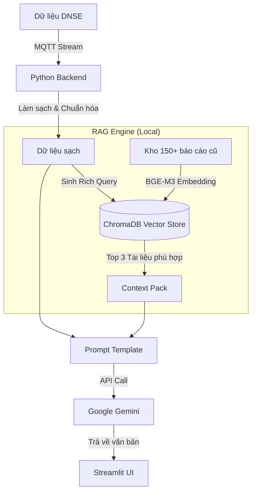

# 📈 Mirae Asset Daily Report Automation (RAG Enhanced - v2.2.0)

> **Hệ thống tự động hóa báo cáo thị trường chứng khoán chuyên sâu, tích hợp RAG (Retrieval-Augmented Generation) để học văn phong từ dữ liệu quá khứ.**


## 1. Giới thiệu
Dự án được xây dựng nhằm giải quyết bài toán "nỗi đau" của chuyên viên phân tích: mất quá nhiều thời gian để thu thập dữ liệu từ nhiều nguồn (Bảng giá, FireAnt, HOSE) và viết đi viết lại các mẫu câu nhận định thị trường. Không chỉ đơn thuần lấy số liệu, hệ thống sử dụng kiến trúc **RAG (Retrieval-Augmented Generation)** để tìm kiếm các bài báo cáo mẫu trong quá khứ có bối cảnh tương tự, từ đó yêu cầu AI viết bài mới với văn phong chuẩn "Chuyên gia".

## 2. Tính năng nổi bật (Key Features)

### 🚀 Tự động hóa dữ liệu (Data Automation)
*   **Real-time Data:** Kết nối trực tiếp **DNSE API (MQTT/WebSocket)** để lấy dữ liệu Snapshot thời gian thực.
*   **Smart Processing:**
    *   Tự động tính toán **Top Tác động** dựa trên trọng số *(% Tăng x Giá trị giao dịch)* để lọc nhiễu Penny.
    *   Phân tích **Hiệu suất Ngành** và tự động chọn mã tiêu biểu (Tăng mạnh nhất/Giảm mạnh nhất) để hiển thị.
    *   Tính toán **Giao dịch Khối ngoại** (Mua/Bán ròng).

### 🧠 Trí tuệ nhân tạo & RAG (The Brain)
*   **Local Vector DB:** Sử dụng **ChromaDB** chạy local để lưu trữ tri thức từ hàng trăm báo cáo cũ.
*   **Advanced Embedding:** Sử dụng model **BAAI/bge-m3** (State-of-the-art) để hiểu ngữ nghĩa tiếng Việt và tài chính sâu sắc.
*   **Rich Query Construction:** Hệ thống tự động biến số liệu thô thành một câu truy vấn ngữ nghĩa (VD: *"Thị trường giảm mạnh, thanh khoản bùng nổ, áp lực bán tháo..."*) để tìm kiếm bài mẫu chính xác nhất.
*   **Generative AI:** Sử dụng **Google Gemini 1.5 Flash** để tổng hợp và viết bài.

### 🖥️ Giao diện tương tác (Dashboard)
*   Hiển thị trực quan 4 cột: Điểm số, Khối lượng, Giá trị (Tỷ đồng), Độ rộng.
*   Cho phép chuyên gia nhập liệu bổ sung (P/E, Điểm kỹ thuật, Nhận định nhanh) trước khi AI viết bài.

---

## 3. Kiến trúc hệ thống (Architecture)



---

## 4. Cài đặt & Sử dụng

### Yêu cầu tiên quyết
*   Python 3.10 trở lên.
*   [Poetry](https://python-poetry.org/) (Quản lý thư viện).
*   **GPU (Khuyến nghị):** Để chạy model Embedding BGE-M3 nhanh hơn (đã cấu hình CUDA).

### Bước 1: Cài đặt thư viện
```bash
git clone https://github.com/your-username/mirae-automation.git
cd mirae-automation
poetry install
```

### Bước 2: Cấu hình môi trường (.env)
Tạo file `.env` và điền thông tin:
```env
DNSE_USERNAME=tai_khoan_dnse
DNSE_PASSWORD=mat_khau_dnse
GOOGLE_API_KEY=api_key_gemini
```

### Bước 3: Nạp dữ liệu cho RAG (Chạy 1 lần đầu)
Bước này sẽ quét thư mục `data_clean_txt`, vector hóa dữ liệu và lưu vào `chroma_db`.
```bash
poetry run python src/services/rag_service.py
```

### Bước 4: Chạy ứng dụng
```bash
poetry run streamlit run src/ui/dashboard.py
```

---

## 5. Lộ trình phát triển (Roadmap)

*   [x] **Phase 1:** Kết nối dữ liệu Real-time & Dashboard cơ bản.
*   [x] **Phase 2:** Tích hợp RAG (Local Embedding + ChromaDB) để học văn phong.
*   [ ] **Phase 3 (Sắp tới):** Tính năng xuất báo cáo ra file **Word (.docx)** chuẩn format công ty để gửi email ngay lập tức.
*   [ ] **Phase 4:** Tự động vẽ biểu đồ kỹ thuật (Chart) và chèn vào báo cáo.

---

## Disclaimer
***Dự án này là công cụ hỗ trợ cá nhân, không phải sản phẩm chính thức của Mirae Asset hay DNSE.***

<br>
<br>

---
---

# 🇬🇧 English Version

> **Automated Daily Market Report Generator for Financial Analysts, featuring RAG (Retrieval-Augmented Generation) to master professional writing styles.**

## 1. Introduction
This project was built to address the "pain point" of financial analysts: spending excessive time collecting data from multiple sources (Price Boards, FireAnt, HOSE) and rewriting repetitive market commentary. Beyond simple data fetching, the system leverages **RAG (Retrieval-Augmented Generation)** architecture to retrieve past reports with similar market contexts, enabling the AI to generate new reports with a standardized "Expert" tone.

## 2. Key Features

### 🚀 Data Automation
*   **Real-time Data:** Direct connection to **DNSE API (MQTT/WebSocket)** for real-time market snapshots.
*   **Smart Processing:**
    *   **Impact Ranking:** Uses a weighted formula *(% Change x Trading Value)* to filter out low-liquidity noise (Penny stocks).
    *   **Sector Analysis:** Automatically calculates sector performance and selects representative stocks (Top Gainers/Losers).
    *   **Foreign Trading:** Calculates Net Buy/Sell values.

### 🧠 AI & RAG (The Brain)
*   **Local Vector DB:** Uses **ChromaDB** (running locally) to store knowledge from hundreds of past reports.
*   **Advanced Embedding:** Utilizes the **BAAI/bge-m3** model (State-of-the-art) for deep semantic understanding of Vietnamese financial terms.
*   **Rich Query Construction:** Automatically converts raw data into a semantic query (e.g., *"Market dropped sharply, liquidity exploded, panic selling pressure..."*) to retrieve the most accurate reference templates.
*   **Generative AI:** Integrates **Google Gemini 1.5 Flash** for synthesis and writing.

### 🖥️ Interactive Dashboard
*   Visualizes 4 key metrics: Index Score, Volume, Value (Billions VND), and Market Breadth.
*   **Human-in-the-loop:** Allows analysts to input supplementary data (P/E, Technical Score, Quick Insights) before AI generation.

---

## 3. System Architecture

[!] It's not too different from the Vietnamese version.

---

## 4. Installation & Usage

### Prerequisites
*   Python 3.10+.
*   [Poetry](https://python-poetry.org/) (Dependency Management).
*   **GPU (Recommended):** For faster BGE-M3 embedding (CUDA configured).

### Step 1: Install Dependencies
```bash
git clone https://github.com/your-username/mirae-automation.git
cd mirae-automation
poetry install
```

### Step 2: Environment Configuration (.env)
Create a `.env` file and fill in the details:
```env
DNSE_USERNAME=your_dnse_username
DNSE_PASSWORD=your_dnse_password
GOOGLE_API_KEY=your_gemini_api_key
```

### Step 3: Data Ingestion (Run Once)
This step scans the `data_clean_txt` folder, vectorizes the data, and stores it in `chroma_db`.
```bash
poetry run python src/services/rag_service.py
```

### Step 4: Run Application
```bash
poetry run streamlit run src/ui/dashboard.py
```

---

## 5. Roadmap

*   [x] **Phase 1:** Real-time Data Connection & Basic Dashboard.
*   [x] **Phase 2:** RAG Integration (Local Embedding + ChromaDB) for style learning.
*   [ ] **Phase 3 (Upcoming):** Export reports to **Word (.docx)** with company formatting for immediate email distribution.
*   [ ] **Phase 4:** Auto-generate Technical Charts and embed them into reports.

---

## Disclaimer
***This project is a personal support tool and is not an official product of Mirae Asset or DNSE.***
