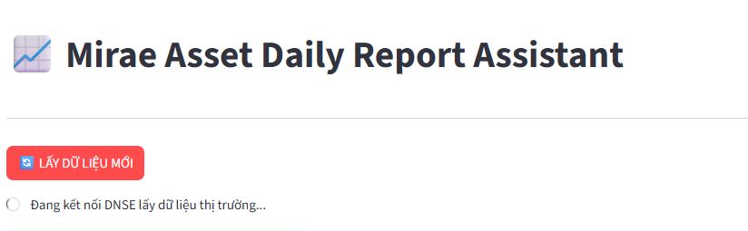
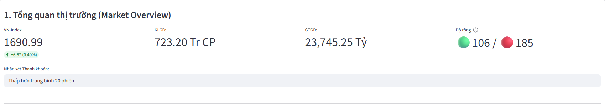
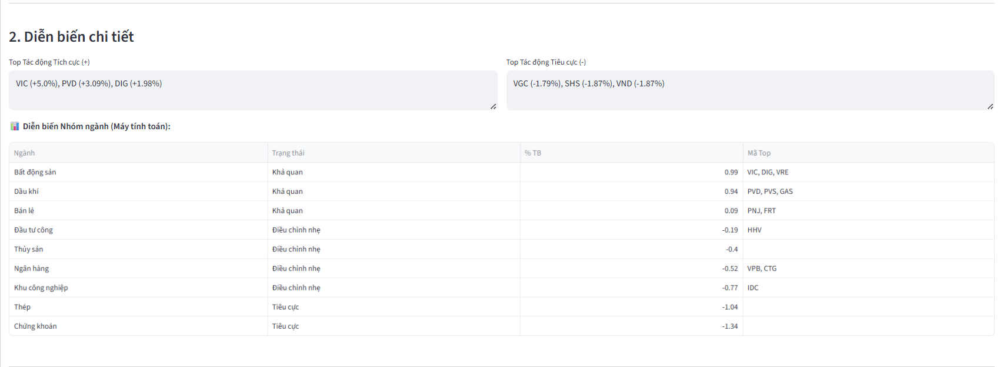
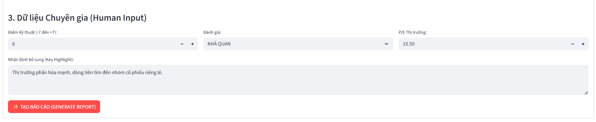

# 📈 Mirae Asset Daily Report Automation

> **Công cụ tự động hóa viết báo cáo thị trường hằng ngày, tích hợp dữ liệu Real-time và AI Generative.**


## 1. Giới thiệu (Introduction)
Dự án được xây dựng nhằm giải quyết bài toán "nỗi đau" của chuyên viên phân tích: mất quá nhiều thời gian để thu thập dữ liệu từ nhiều nguồn (Bảng giá, FireAnt, HOSE) và viết đi viết lại các mẫu câu nhận định thị trường.

Hệ thống hoạt động theo cơ chế **Human-in-the-loop**:
1.  **Auto Fetch:** Tự động lấy dữ liệu thị trường, tính toán chỉ số ngành, dòng tiền.
2.  **Human Review:** Chuyên viên kiểm tra, chỉnh sửa các nhận định định tính.
3.  **AI Write:** Sử dụng LLM (Qwen 3.5) để viết báo cáo hoàn chỉnh theo văn phong chuyên nghiệp.

---

## 2. Demo Sản phẩm (Prototype Showcase)

**Phiên bản hiện tại:** `v1.1.0 (MVP)`

### 📸 Giao diện Dashboard & Tổng quan thị trường
Hệ thống tự động kết nối API DNSE, lấy dữ liệu VN-Index, Thanh khoản (Khối lượng/Giá trị) và Độ rộng thị trường (Số mã Tăng/Giảm/Trần/Sàn) chỉ với 1 cú click.

*(Ảnh: Trạng thái cập nhập dữ liệu)*


---

*(Ảnh: Màn hình tổng quan số liệu)*
 

### 📊 Phân tích Dòng tiền & Nhóm ngành
Logic thông minh tự động tính toán:
*   **Top Tác động:** Sử dụng thuật toán trọng số *(% Tăng x Giá trị giao dịch)* để lọc ra các mã trụ (Bluechip) tác động thực sự tới chỉ số, loại bỏ nhiễu từ các mã Penny thanh khoản thấp.
*   **Hiệu suất Ngành:** Tự động gom nhóm cổ phiếu (Bank, Chứng, Thép...) và đánh giá trạng thái (Tích cực/Tiêu cực/Phân hóa).

*(Ảnh: Phân tích chi tiết)*


### 🤖 Human Input & AI Generation
Khu vực dành cho chuyên gia nhập liệu các chỉ số nâng cao (P/E, Technical Score) và nhận định nhanh. Sau đó AI sẽ tổng hợp tất cả để viết bài.

*(Ảnh: Nhập liệu chuyên gia)*


---

## 3. Trạng thái phát triển (Current Status)

Dự án đang ở giai đoạn **MVP (Minimum Viable Product)** và đã hoạt động ổn định các tính năng cốt lõi:

*   ✅ **Data Source:** Kết nối trực tiếp **DNSE API** (thông qua giao thức MQTT/WebSocket) để lấy dữ liệu Snapshot thời gian thực.
*   ✅ **Data Processing:**
    *   Xử lý làm tròn số liệu chuẩn báo cáo.
    *   Tính toán độ rộng thị trường (Gộp mã Trần vào Tăng, Sàn vào Giảm).
    *   Thuật toán Ranking cổ phiếu tác động (Impact Score).
*   ✅ **User Interface:** Giao diện Streamlit tương tác, cho phép chỉnh sửa số liệu trước khi tạo báo cáo.
*   ✅ **AI Engine:** Tích hợp **Google Gemini (Pro/Flash)** để sinh văn bản tự động.

---

## 4. Lộ trình phát triển (Roadmap)

Kế hoạch nâng cấp hệ thống trong thời gian tới để tối ưu hóa khả năng phân tích và bảo mật.

### 🚀 Giai đoạn sắp tới (Next Steps)
*   [ ] **AI Engine:** Hoàn thiện kiến trúc RAG, sử dụng Model Embedding (Nomic-Embed-Text), lưu trữ thông qua LanceDB, vàtích hợp **Qwen 3.5** để sinh văn bản tự động.
*   [ ] **Export to Docx:** Xuất báo cáo ra file Word (.docx) theo đúng Template chuẩn của công ty (Header, Footer, Logo).
*   [ ] **Biểu đồ kỹ thuật:** Tự động vẽ và chèn ảnh Chart VN-Index vào báo cáo.
*   [ ] **Quản lý cấu hình:** Cho phép người dùng tự thêm/bớt mã vào danh sách theo dõi ngành ngay trên giao diện.

### 🧠 Tầm nhìn dài hạn (Future Vision - RAG & Local LLM)
Chuyển đổi từ mô hình gọi API sang mô hình **AI Local** để bảo mật dữ liệu tuyệt đối và học văn phong đặc thù.
*   **Local Model:** Triển khai **Ollama (Llama 3 / Vinallama)** chạy offline trên máy cá nhân.
*   **RAG (Retrieval-Augmented Generation):**
    *   Xây dựng kho tri thức từ hàng trăm file PDF báo cáo cũ.
    *   Giúp AI "nhớ" lại bối cảnh thị trường các phiên trước và bắt chước giọng văn (Tone & Voice) chính xác của Mirae Asset.

---

## 5. Cài đặt & Sử dụng (Installation)

Yêu cầu: Python 3.10+ và [Poetry](https://python-poetry.org/).

```bash
# 1. Clone dự án
git clone https://github.com/NDPhuu/mirae-automation.git

# 2. Cài đặt thư viện
poetry install

# 3. Cấu hình môi trường (.env)
# Tạo file .env và điền thông tin:
# DNSE_USERNAME=...
# DNSE_PASSWORD=...
# GOOGLE_API_KEY=...

# 4. Chạy ứng dụng
poetry run streamlit run src/ui/dashboard.py
```
---

## Disclaimer: 
***Dự án này là công cụ hỗ trợ cá nhân, không phải sản phẩm chính thức của Mirae Asset hay DNSE.***