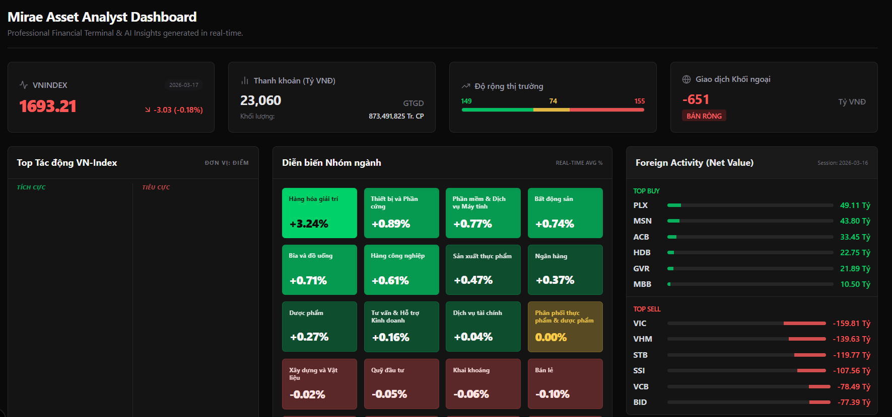
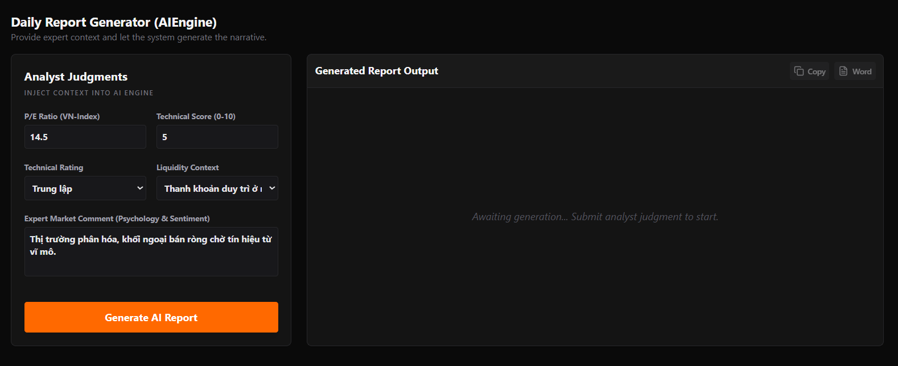
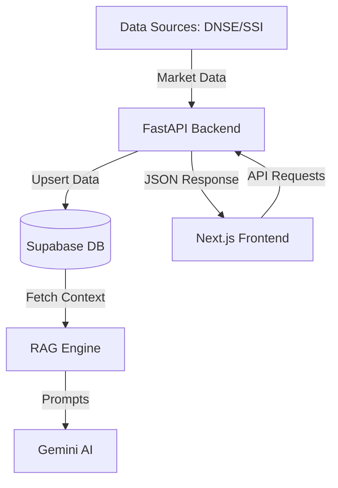

# 📈 Mirae Asset Daily Report Automation (Ver 2.1.0)

Hệ thống tự động hóa tổng hợp dữ liệu thị trường và hỗ trợ viết báo cáo nhận định thị trường.
Automated market data aggregation and daily report generation support system.

---

## Project Gallery

*Giao diện Dashboard theo dõi thị trường thời gian thực / Real-time Market Dashboard*

*Báo cáo nhận định tự động tạo bởi AI / AI-Generated Market Commentary*

---

## Kiến trúc hệ thống / System Architecture

```mermaid
graph TD
    A[Data Sources: DNSE/SSI] -->|Market Data| B[FastAPI Backend]
    B -->|Upsert Data| C[(Supabase DB)]
    C -->|Fetch Context| D[RAG Engine]
    D -->|Prompts| E[Gemini AI]
    F[Next.js Frontend] -->|API Requests| B
    B -->|JSON Response| F
```

---

## 🇻🇳 Tiếng Việt

### 1. Giới thiệu
Hệ thống hiện đại tích hợp AI để tự động hóa quy trình phân tích thị trường chứng khoán. Dự án đã chuyển đổi sang kiến trúc decoupled hoàn toàn với Frontend riêng biệt để tối ưu trải nghiệm người dùng.

### 2. Công nghệ sử dụng
- **Frontend:** Next.js 15+ (React 19), Tailwind CSS 4.
- **Backend:** Python FastAPI.
- **Database:** Supabase (PostgreSQL) Cloud.
- **AI/RAG:** Google Gemini + ChromaDB + BGE-M3 Embedding.

### 3. Tính năng chính
- **Real-time Dashboard:** Theo dõi giá, khối lượng và độ rộng thị trường trực tiếp.
- **Top Tác động:** Phân tích đóng góp điểm số VN-Index (Point-based).
- **Khối ngoại:** Tự động lấy dữ liệu giao dịch ròng từ SSI.
- **AI Report:** Tự động tạo bản thảo báo cáo nhận định chuyên nghiệp dựa trên dữ liệu thực tế và mẫu báo cáo cũ.

### 4. Cài đặt nhanh
#### Backend
1. Clone dự án và chạy `poetry install`.
2. Cấu hình file `.env`.
3. Chạy Server: `poetry run uvicorn src.api.main:app --reload`.

#### Frontend
1. Truy cập thư mục `frontend/`.
2. Chạy `npm install`.
3. Khởi động: `npm run dev`.

---

## 🇬🇧 English

### 1. Introduction
A modern AI-integrated system to automate stock market analysis workflows. The project has transitioned to a professional decoupled architecture with a dedicated frontend.

### 2. Tech Stack
- **Frontend:** Next.js 15+ (React 19), Tailwind CSS 4.
- **Backend:** Python FastAPI.
- **Database:** Supabase (PostgreSQL) Cloud.
- **AI/RAG:** Google Gemini + ChromaDB + BGE-M3 Embedding.

### 3. Key Features
- **Real-time Dashboard:** Live tracking of prices, volume, and market breadth.
- **Market Impact:** Accurate point-based contribution analysis for VN-Index.
- **Foreign Trading:** Synchronized net buy/sell data fetching.
- **AI Report:** Generates professional-grade market commentary using live data and historical templates.

### 4. Quick Start
#### Backend
1. Clone the repository and run `poetry install`.
2. Configure your `.env` file.
3. Run Server: `poetry run uvicorn src.api.main:app --reload`.

#### Frontend
1. Navigate to `frontend/` directory.
2. Run `npm install`.
3. Run Development: `npm run dev`.

---

## 📝 Ghi chú / Note
Dự án này là công cụ hỗ trợ cho việc phân tích, không phải sản phẩm chính thức.
This project is a dedicated tool for analyzing, not an official product.
