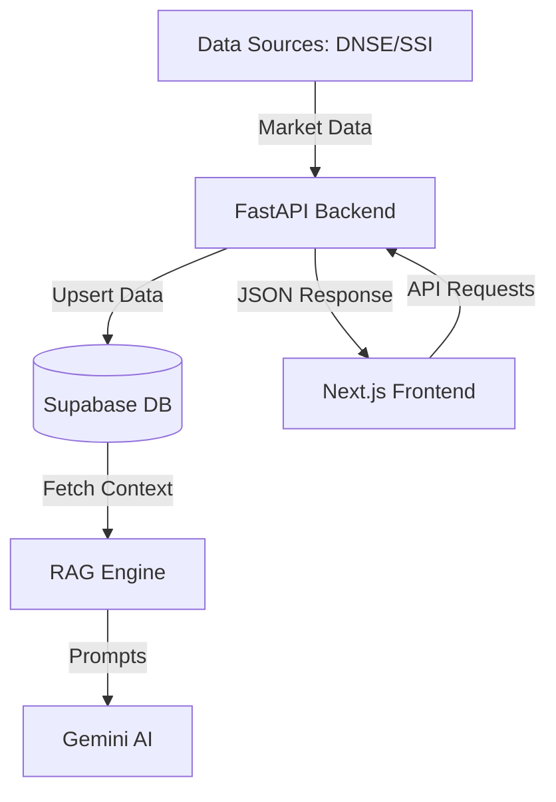

# Mirae Asset Daily Report Automation (Ver 2.2.5)
 
 - *Hệ thống tự động hóa tổng hợp dữ liệu thị trường và hỗ trợ viết báo cáo nhận định thị trường (Automated market data aggregation and daily report generation support system).*

---

## Project Gallery

*Giao diện Dashboard theo dõi thị trường thời gian thực / Real-time Market Dashboard*

*Báo cáo nhận định tự động tạo bởi AI / AI-Generated Market Commentary*

---

## Kiến trúc hệ thống / System Architecture

```mermaid
graph TD
    A[Data Sources: DNSE/SSI] -->|Market Data| B[FastAPI Backend]
    B -->|Upsert Data| C[(Supabase DB)]
    C -->|Fetch Context| D[RAG Engine]
    D -->|Prompts| E[Gemini AI]
    F[Next.js Frontend] -->|API Requests| B
    B -->|JSON Response| F
```

---

## 🇻🇳 Tiếng Việt

### 1. Giới thiệu
- Dự án xây dựng Hybrid RAG AI Assistant để tự động hóa quy trình phân tích thị trường chứng khoán, nhằm giải quyết nỗi đau của Analysts: *Mất quá nhiều thời gian để thu thập dữ liệu từ nhiều nguồn (Bảng giá, FireAnt, HOSE, v.v) và viết đi viết lại các mẫu câu nhận định thị trường.*
- **Current State**: Dự án đã chuyển đổi sang kiến trúc decoupled, xây dựng Frontend để tối ưu trải nghiệm người dùng.

### 2. Công nghệ sử dụng
- **Frontend:** Next.js 15+ (React 19), Tailwind CSS 4.
- **Backend:** Python FastAPI.
- **Database:** Supabase (PostgreSQL) Cloud.
- **AI/RAG:** Google Gemini 2.0 + ChromaDB + BGE-M3 Embedding.

### 3. Tính năng chính
- **Real-time Dashboard:** Theo dõi chỉ số, giá, top tác động, khối lượng, độ rộng thị trường, diễn biến nhóm ngành, giao dịch khối ngoại, etc.
- **Top tác động đến VNINDEX:** Phân tích đóng góp điểm số VNINDEX (Point-based).
- **Giao dịch khối ngoại:** Tự động lấy dữ liệu giao dịch ròng từ SSI.
- **AI Report:** Tự động tạo báo cáo nhận định thị trường học theo văn phong Analysts dựa trên dữ liệu thực tế và 160+ mẫu báo cáo cũ.
- **Human Review:** Chuyên viên kiểm tra, chỉnh sửa các nhận định định tính.

### 4. Cài đặt nhanh
#### Backend
1. Clone dự án và chạy `poetry install`.
2. Cấu hình file `.env`.
3. Chạy Server: `poetry run uvicorn src.api.main:app --reload`.

#### Frontend
1. Truy cập thư mục `frontend/`.
2. Chạy `npm install`.
3. Khởi động: `npm run dev`.

---

## 🇬🇧 English

### 1. Introduction
- Built an Hybrid RAG AI Assistant Project to automate parts of the stock market analysis workflow, addressing a key pain point for analysts: *Excessive time spent collecting data from multiple sources (price boards, FireAnt, HOSE, etc.) and repeatedly writing similar market commentary.*
- **Current State:** The project has been migrated to a decoupled architecture, with a dedicated frontend developed to improve user experience.

### 2. Tech Stack
- **Frontend:** Next.js 15+ (React 19), Tailwind CSS 4.
- **Backend:** Python FastAPI.
- **Database:** Supabase (PostgreSQL) Cloud.
- **AI/RAG:** Google Gemini + ChromaDB + BGE-M3 Embedding.

### 3. Key Features
- **Real-time Dashboard:** Live tracking of Index, Prices, Top Impact, Volume, Market breadth, Sector Trends, Foreign Trading activities, etc.
- **Top Impact on VNINDEX:** Accurate point-based contribution analysis for VNINDEX (Point-based).
- **Foreign Trading:** Synchronized net buy/sell data fetching.
- **AI Report:** Generates analysts-grade daily market commentary using real-time data and historical templates.
- **Human Review:** Analysts checking and refining qualitative judgments.

### 4. Quick Start
#### Backend
1. Clone the repository and run `poetry install`.
2. Configure your `.env` file.
3. Run Server: `poetry run uvicorn src.api.main:app --reload`.

#### Frontend
1. Navigate to `frontend/` directory.
2. Run `npm install`.
3. Run Development: `npm run dev`.

---

## 📝 Ghi chú / Note
Dự án này là công cụ hỗ trợ cho việc phân tích, không phải sản phẩm chính thức.
This project is a dedicated tool for analyzing, not an official product.
