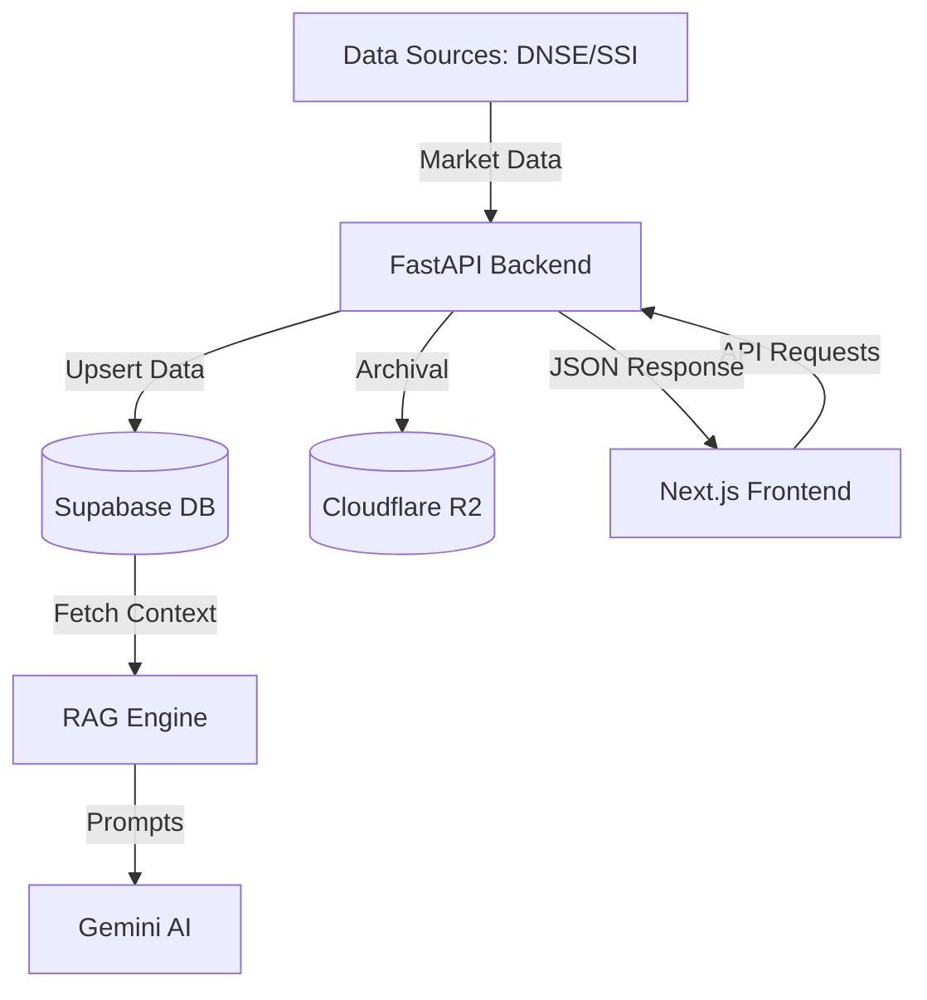

# Mirae Asset Daily Report Automation (Ver 2.3.0)
 
 - *Hệ thống tự động hóa tổng hợp dữ liệu thị trường và hỗ trợ viết báo cáo nhận định thị trường (Automated market data aggregation and daily report generation support system).*

---

## Project Gallery

*Giao diện Dashboard theo dõi thị trường thời gian thực / Real-time Market Dashboard*

*Báo cáo nhận định tự động tạo bởi AI / AI-Generated Market Commentary*

---

## Kiến trúc hệ thống / System Architecture

```mermaid
graph TD
    A[Data Sources: DNSE/SSI] -->|Market Data| B[FastAPI Backend]
    B -->|Upsert Data| C[(Supabase DB)]
    C -->|Fetch Context| D[RAG Engine]
    B -->|Archival| G[(Cloudflare R2)]
    D -->|Prompts| E[Gemini AI]
    F[Next.js Frontend] -->|API Requests| B
    B -->|JSON Response| F
```

---

## 🇻🇳 Tiếng Việt

### 1. Giới thiệu
- Dự án xây dựng Hybrid RAG AI Assistant để tự động hóa quy trình phân tích thị trường chứng khoán, nhằm giải quyết nỗi đau của Analysts: *Mất quá nhiều thời gian để thu thập dữ liệu từ nhiều nguồn (Bảng giá, FireAnt, HOSE, v.v) và viết đi viết lại các mẫu câu nhận định thị trường.*
- **Current State**: Hệ thống đã hoàn thiện cơ chế đồng bộ dữ liệu thông minh, tối ưu hiệu năng và tích hợp AI phân tích sâu.

### 2. Công nghệ sử dụng
- **Frontend:** Next.js 15+ (React 19), Tailwind CSS 4.
- **Backend:** Python FastAPI.
- **Database:** Supabase (PostgreSQL) Cloud.
- **Infrastructure:** Cloudflare R2 (Parquet Archival).
- **AI/RAG:** Google Gemini 1.5/2.0 + ChromaDB + BGE-M3 Embedding.

### 3. Tính năng chính (Cập nhật 2.3.0)
- **Smart Polling Control:** Tự động nhận diện giờ giao dịch VN (9:00 - 15:15). Tự động ngắt đồng bộ khi thị trường đóng cửa để tiết kiệm tài nguyên, hỗ trợ "Live Mode" thủ công.
- **Enhanced Foreign Trading Sync:** Cơ chế đồng bộ SSI session-aware, đảm bảo dữ liệu khớp 100% với Heatmap (MSN, VNM, MWG, etc.) và ghi đè dữ liệu cũ tức thì (Immediate Flush).
- **Real-time Dashboard:** Theo dõi chỉ số, giá, top tác động, khối lượng, độ rộng thị trường, diễn biến nhóm ngành.
- **AI Report:** Tự động tạo báo cáo nhận định thị trường học theo văn phong Analysts dựa trên dữ liệu thực tế và 160+ mẫu báo cáo cũ.
- **Data Archival:** Tự động đóng gói dữ liệu cũ (Parquet) và lưu trữ lên Cloudflare R2 để tối ưu hóa kích thước Database.

### 4. Cài đặt nhanh
#### Backend
1. Clone dự án và chạy `poetry install`.
2. Cấu hình file `.env` (Cần SSI API & R2 Keys).
3. Chạy Server: `poetry run uvicorn src.api.main:app --reload`.

#### Frontend
1. Truy cập thư mục `frontend/`.
2. Chạy `npm install`.
3. Khởi động: `npm run dev`.

---

## 🇬🇧 English

### 1. Introduction
- Built an Hybrid RAG AI Assistant Project to automate parts of the stock market analysis workflow, addressing a key pain point for analysts: *Excessive time spent collecting data from multiple sources and repeatedly writing similar market commentary.*
- **Current State:** Fully automated data synchronization with high-performance real-time updates and deep AI integration.

### 2. Tech Stack
- **Frontend:** Next.js 15+ (React 19), Tailwind CSS 4.
- **Backend:** Python FastAPI.
- **Database:** Supabase (PostgreSQL) Cloud.
- **Infrastructure:** Cloudflare R2 (Parquet Archival).
- **AI/RAG:** Google Gemini + ChromaDB + BGE-M3 Embedding.

### 3. Key Features (Update 2.3.0)
- **Smart Polling Control:** Intelligent Vietnam Market hours detection (9:00 - 15:15). Automatically pauses polling during off-hours with "Live Mode" manual override.
- **Enhanced Foreign Trading Sync:** SSI session-aware sync logic ensures 100% accuracy with Heatmaps (MSN, VNM, etc.) with Immediate Flush writes.
- **Real-time Dashboard:** Live tracking of Index, Prices, Top Impact, Volume, Market breadth, and Sector Trends.
- **AI Report:** Generates analyst-grade daily market commentary using real-time data and historical templates.
- **Cloud Archival:** Automatically archives historical data to Parquet files on Cloudflare R2 to maintain light Database performance.

### 4. Quick Start
#### Backend
1. Clone the repository and run `poetry install`.
2. Configure your `.env` file (SSI API & R2 Keys required).
3. Run Server: `poetry run uvicorn src.api.main:app --reload`.

#### Frontend
1. Navigate to `frontend/` directory.
2. Run `npm install`.
3. Run Development: `npm run dev`.

---

## 📝 Ghi chú / Note
Dự án này là công cụ hỗ trợ cho việc phân tích, không phải sản phẩm chính thức.
This project is a dedicated tool for analyzing, not an official product.
