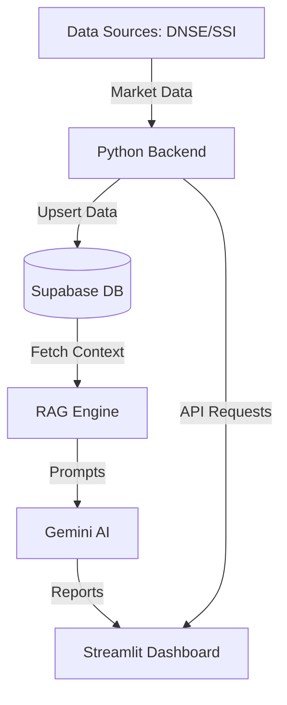

# 📈 Mirae Asset Daily Report Automation (Ver 2.0.0)

Hệ thống tự động hóa tổng hợp dữ liệu thị trường và hỗ trợ viết báo cáo nhận định hàng ngày.
Automated market data aggregation and daily report generation support system.

---

## 🖼️ Project Gallery

*Giao diện Dashboard theo dõi thị trường thời gian thực / Real-time Market Dashboard*

*Báo cáo nhận định tự động tạo bởi AI / AI-Generated Market Commentary*

---

## 🇻🇳 Tiếng Việt

### 1. Giới thiệu
Dự án giúp tự động hóa việc thu thập số liệu thị trường chứng khoán Việt Nam và hỗ trợ viết báo cáo hàng ngày. Hệ thống lấy dữ liệu trực tiếp từ các nguồn uy tín (SSI/DNSE), tính toán các chỉ số quan trọng và sử dụng AI để tạo văn bản nhận định.

### 2. Tính năng chính
- **Dữ liệu thời gian thực:** Kết nối DNSE API để lấy giá, khối lượng và độ rộng thị trường.
- **Top Tác động:** Tính toán chính xác mức độ đóng góp của cổ phiếu vào VN-Index (Point-based).
- **Khối ngoại:** Tự động lấy dữ liệu mua bán ròng từ SSI.
- **Hỗ trợ AI:** Sử dụng Google Gemini để viết nhận định thị trường dựa trên số liệu thực tế và các mẫu báo cáo cũ (RAG).
- **Session Update:** Cập nhập dữ liệu real-time trong phiên.
- **Supabase Cloud:** Sử dụng PostgreSQL từ Supabase làm cơ sở dữ liệu chính để lưu trữ giá cổ phiếu, khối ngoại và chỉ số thị trường.

### 3. Kiến trúc hệ thống

```mermaid
graph TD
    A[Data Sources: DNSE/SSI] -->|Market Data| B[Python Backend]
    B -->|Upsert Data| C[(Supabase DB)]
    C -->|Fetch Context| D[RAG Engine]
    D -->|Prompts| E[Gemini AI]
    E -->|Reports| F[Streamlit Dashboard]
    B -->|API Requests| F
```

*Hệ thống lấy dữ liệu real-time từ DNSE và SSI, xử lý và lưu trữ vào Supabase PostgreSQL. Gemini AI hỗ trợ viết báo cáo nhận định, hiển thị trên Dashboard Streamlit.*

### 4. Cài đặt nhanh
1. Cài đặt Python 3.10+ và Poetry.
2. Clone dự án và chạy `poetry install`.
3. Cấu hình API Key (DNSE, SSI, Gemini) trong file `.env`.
4. Chạy Dashboard: `poetry run streamlit run src/ui/dashboard.py`.

---

## 🇬🇧 English

### 1. Introduction
This project automates the aggregation of Vietnamese stock market data and assists in writing daily market reports. The system fetches data directly from reliable sources, calculates key metrics, and uses AI to generate market commentary.

### 2. Key Features
- **Real-time Data:** Connects to DNSE API for live prices, volume, and market breadth.
- **Market Impact:** Accurately calculates stock contributions to the VN-Index (Point-based).
- **Foreign Trading:** Automatically fetches net buy/sell data from SSI.
- **AI Support:** Uses Google Gemini to write market reports based on live data and historical templates (RAG).
- **Session Guard:** Smart session management that transitions data at 09:15 AM.
- **Supabase Cloud:** Uses Supabase's PostgreSQL as the primary database for storing stock prices, foreign trading data, and market indices.

### 3. Architecture
....

### 4. Quick Start
1. Install Python 3.10+ and Poetry.
2. Clone the repository and run `poetry install`.
3. Configure API Keys (DNSE, SSI, Gemini) in the `.env` file.
4. Run the Dashboard: `poetry run streamlit run src/ui/dashboard.py`.

---

## 📝 Ghi chú / Note
Dự án này là công cụ hỗ trợ cá nhân, không phải sản phẩm chính thức.
This project is a personal support tool, not an official product.
